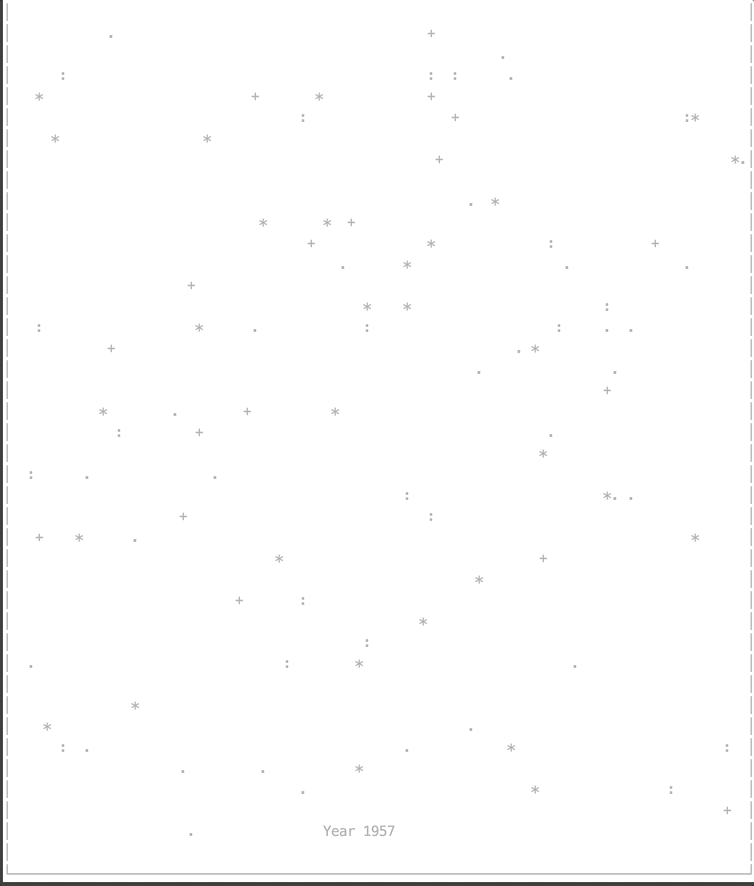

# Space game

It is the asynchronous space game. You are in 1956 and fly ahead. After 1961 you meet a lot of garbage and you must fly around the obstacle. Each year the speed garbage will be increase. After the 1970 year, your space ship set up a laser weapon. In 2020, the speed of garbage will be maximal. Try to go ahead and don't deathbed.

# How it works


# Install and play
Download this repository on your pc with a console or terminal.
```
git clone https://github.com/djeck1432/space_game.git
```
Open the folder `space_game` next command in terminal:
```
cd space_game
```
Install the required libraries:
```
pip3 install -r requirements.txt
```
Run the game:
```
python3 main.py
```
